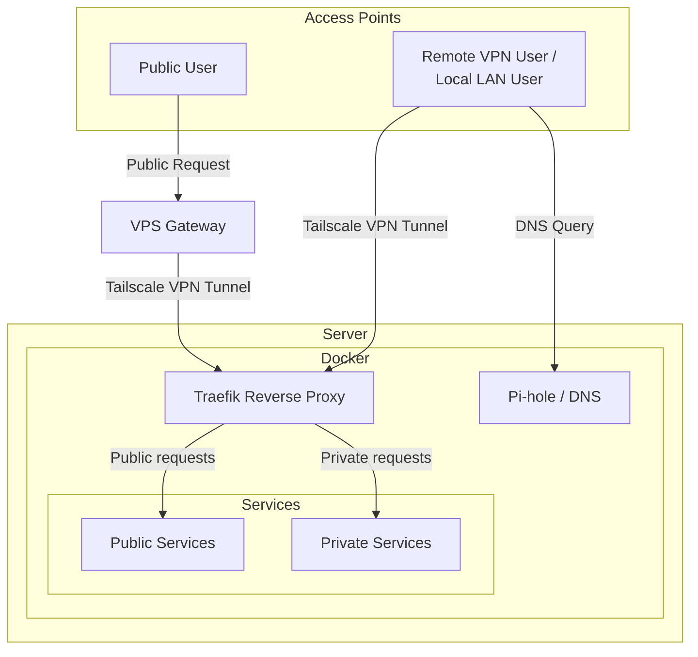

# My Homelab Setup

```mermaid
graph TD
    subgraph Users [Access Points]
        InternetUser[Public User]:::external
        VPNUser[Remote VPN User /
        Local LAN User]:::external
    end

    VPS[VPS Gateway]:::device

    subgraph RealServer [Server]

        subgraph DockerEnv [Docker]

            Traefik[Traefik Reverse Proxy]:::container
            PiHole[Pi-hole / DNS]:::container

            subgraph Services
                PublicApps[Public Services]:::container
                PrivateApps[Private Services]:::container
            end
        end
    end

    InternetUser -- Public Request --> VPS
    VPS -- Tailscale VPN Tunnel --> Traefik

    VPNUser -- DNS Query --> PiHole
    VPNUser -- Tailscale VPN Tunnel --> Traefik

    Traefik -- Public requests --> PublicApps
    Traefik -- Private requests --> PrivateApps

    class RealServer device;
    class DockerEnv docker;

```
